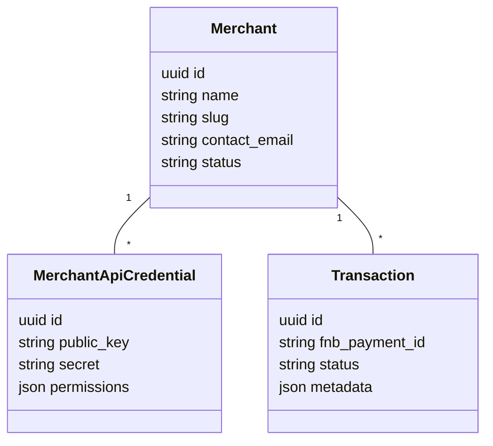

# Architecture Overview

This document explains the key architectural decisions for the First National Bank (FNB) payment gateway blueprint.

## Domain model

## Payment flow

1. Merchant-initiated requests hit `POST /api/merchants/{merchant}/payments`.
2. The `PaymentController` validates the payload and delegates to `FnbClient`.
3. `FnbClient` acquires an OAuth token using client credentials and forwards the request to FNB.
4. A `Transaction` record is persisted locally with the authoritative FNB response.
5. Webhooks from FNB update the transaction lifecycle asynchronously via signature validated `WebhookController`.

## Security controls

- **OAuth 2.0** – short-lived tokens cached in Redis (`HttpClientFactory::makeWithToken`).
- **Mutual TLS** – optional certificate pinning if the FNB channel requires it.
- **Webhook verification** – SHA-256 HMAC with replay protection via timestamp validation hooks.
- **Idempotency** – unique `Idempotency-Key` header on each outbound call.

## Extensibility

- Command bus is used for nightly settlement and reconciliation tasks.
- Feature tests rely on Pest + Mockery allowing safe regression coverage without hitting the real API.
- Permissions and roles are powered by `spatie/laravel-permission` enabling fine-grained merchant access.
